# MCP Auto PR System

**Intelligent PR boundary detection and recommendation system powered by Model Context Protocol (MCP)**

Automatically analyzes outstanding code changes and generates atomic, logically-grouped pull request recommendations optimized for code review efficiency and deployment safety.


MCP Auto PR is comprised of two MCP agents:
1. local_repo_analyzer - calls git client to analyze outstanding changes that have not made their way to source control.
2. pr_recommender - generates PR recommendations for the outstanding changes.

## MCP Auto PR In Action


## MCP Auto PR Use Cases

```mermaid 
  graph TD
    subgraph "High-Level Workflow"
        Dev[👨‍💻 Developer]
        IDE[💻 IDE + AI Assistant]
        System[🤖 MCP Auto PR System]
        Results[📊 Intelligent PR Strategy]
        
        Dev --> IDE
        IDE --> System
        System --> Results
        Results --> Dev
    end
```

```mermaid 
graph TB
    subgraph "Step 1: Analysis Request"
        Dev1[👨‍💻 Developer] 
        Chat1["💬 'Analyze my repository changes'"]
        Analyzer[🔍 MCP Repo Analyzer<br/>Port 9070]
        Analysis["📊 Analysis Results<br/>• 12 files, 3 repos<br/>• Risk assessment<br/>• Change categorization"]
    end
    
    subgraph "Step 2: Recommendation Request"  
        Dev2[👨‍💻 Developer]
        Chat2["💬 'Generate PR recommendations<br/>for these changes'"]
        Recommender[🧠 MCP PR Recommender<br/>Port 9071]
        PRs["🎯 PR Recommendations<br/>• 6 intelligent PRs<br/>• Dependency ordering<br/>• Review time estimates"]
    end
    
    Dev1 --> Chat1
    Chat1 --> Analyzer
    Analyzer --> Analysis
    Analysis --> Dev1
    
    Dev1 -.-> Dev2
    Dev2 --> Chat2
    Chat2 --> Recommender
    Recommender --> PRs
    PRs --> Dev2
```




## 🚀 Quick Start (30 seconds!)

### One-Command Install (Recommended)
```bash
git clone https://github.com/manavgup/mcp_auto_pr.git
cd mcp_auto_pr
./install.sh
```

### Alternative Methods
```bash
# Docker setup
./install.sh --docker

# Poetry setup  
./install.sh --poetry

# Legacy setup
./setup.sh && ./scripts/docker-setup.sh
```

## 🏗️ Repository Architecture

| Repository | Purpose | Status |
|------------|---------|--------|
| [mcp_shared_lib](https://github.com/manavgup/mcp_shared_lib) | Shared models, tools, utilities | ✅ Active |
| [mcp_local_repo_analyzer](https://github.com/manavgup/mcp_local_repo_analyzer) | Analyzes repository changes | ✅ Active |
| [mcp_pr_recommender](https://github.com/manavgup/mcp_pr_recommender) | Generates PR recommendations | ✅ Active |
| [mcp_auto_pr](https://github.com/manavgup/mcp_auto_pr) | Project coordination & Docker orchestration | ✅ Active |

## 🐳 Docker Deployment

### Services
- **MCP Repo Analyzer**: `http://localhost:9070` - Change detection and analysis
- **MCP PR Recommender**: `http://localhost:9071` - AI-powered PR strategy generation

### Docker Commands
```bash
# Start services
docker-compose up -d

# View logs
docker-compose logs -f

# Stop services  
docker-compose down

# Health check
curl http://localhost:9070/health
curl http://localhost:9071/health
```

### Development Mode
```bash
# Start with live code reloading
docker-compose -f docker-compose.yml -f docker-compose.dev.yml up
```

## 🔌 IDE Integration

### VS Code/Cursor Configuration
Add to your MCP settings:
```json
{
  "mcpServers": {
    "repo-analyzer": {
      "command": "docker",
      "args": ["exec", "-i", "mcp-repo-analyzer", "python", "-m", "mcp_local_repo_analyzer.main"],
      "transport": "stdio"
    },
    "pr-recommender": {
      "command": "docker", 
      "args": ["exec", "-i", "mcp-pr-recommender", "python", "-m", "mcp_pr_recommender.main"],
      "transport": "stdio"
    }
  }
}
```

### Cline Integration
```json
{
  "mcpServers": {
    "repo-analyzer": {
      "timeout": 120,
      "type": "stdio",
      "command": "poetry",
      "args": ["run", "python", "-m", "mcp_local_repo_analyzer.main"],
      "cwd": "./mcp_local_repo_analyzer"
    },
    "pr-recommender": {
      "timeout": 120,
      "type": "stdio", 
      "command": "poetry",
      "args": ["run", "python", "-m", "mcp_pr_recommender.main"],
      "cwd": "./mcp_pr_recommender",
      "env": {
        "OPENAI_API_KEY": "${OPENAI_API_KEY}"
      }
    }
  }
}
```

## 🎯 Available Tools

### MCP Repo Analyzer
- `analyze_working_directory` - Analyze uncommitted changes with risk assessment
- `analyze_staged_changes` - Analyze staged changes ready for commit
- `get_outstanding_summary` - Comprehensive change summary across repositories
- `compare_with_remote` - Compare local branch with remote branch
- `analyze_repository_health` - Overall repository health metrics

### MCP PR Recommender  
- `generate_pr_recommendations` - Generate intelligent PR groupings with dependency ordering
- `analyze_pr_feasibility` - Analyze PR feasibility and potential conflicts
- `get_strategy_options` - Available grouping strategies (semantic, size-based, etc.)
- `validate_pr_recommendations` - Validate and refine recommendations

## 📁 Workspace Structure

```
mcp_workspace/
├── mcp_auto_pr/                    # Main coordination repo
│   ├── docker-compose.yml         # Docker orchestration  
│   ├── scripts/                   # Setup and utility scripts
│   │   ├── docker-setup.sh       # Docker deployment
│   │   ├── test-servers.sh       # Server testing
│   │   └── health-check.sh       # Health monitoring
│   ├── docs/                     # Documentation
│   └── Makefile                  # Build commands
├── mcp_shared_lib/               # Shared utilities and models
├── mcp_local_repo_analyzer/      # Repository change analysis
├── mcp_pr_recommender/           # PR recommendation engine
└── mcp_workspace.code-workspace  # VSCode workspace file
```

## 🛠️ Development

### Environment Setup
```bash
# Python ≥ 3.10
# Poetry for dependency management
# Docker & Docker Compose (optional)

make setup-auto        # Auto-clone all repos and setup
make install-all        # Install all dependencies
make test-all          # Run all tests
make serve-analyzer    # Start analyzer service (port 8001)
make serve-recommender # Start recommender service (port 8002)
```

### Available Make Commands
```bash
# Setup & Installation
make setup-workspace   # Initialize entire workspace
make setup-auto        # Auto-clone all repos and setup
make test-setup        # Test if workspace is properly setup
make install-all       # Install all repo dependencies
make update-all        # Update all repo dependencies

# Testing
make test-all          # Run tests across all repos
make test-shared       # Test shared library
make test-analyzer     # Test local repo analyzer
make test-recommender  # Test PR recommender
make test-integration  # Run workspace integration tests

# Code Quality
make lint-all          # Run linting across all repos
make format-all        # Format code across all repos

# Services
make serve-analyzer    # Start analyzer service (port 8001)
make serve-recommender # Start recommender service (port 8002)
make serve-all         # Start all MCP servers
make check-servers     # Check if servers can be started
make stop-servers      # Stop all MCP servers

# Cleanup
make clean-all         # Clean all repos
make reset-workspace   # Reset entire workspace

# Build & Package
make build-all         # Build all packages
make package-all       # Package all components
```

### Development Scripts
```bash
# Available scripts in scripts/ directory
./scripts/setup-workspace.sh    # Initialize workspace
./scripts/test-setup.sh         # Test workspace setup
./scripts/test-servers.sh       # Test server functionality
./scripts/test-integration.sh   # Integration tests
./scripts/test-enhanced-mcp.sh  # Enhanced MCP testing
./scripts/health-check.sh       # Health monitoring
./scripts/docker-setup.sh       # Docker environment setup
./scripts/setup-dev-env.sh      # Development environment
./scripts/config.sh             # Configuration management
./scripts/post-clone.sh         # Post-clone setup

# Root-level setup scripts
./install.sh                    # One-command install
./setup.sh                      # Legacy setup
./mcp_bridge_setup.sh          # MCP bridge configuration
./stdio_gateway_setup.sh       # STDIO gateway setup
```

### Testing
```bash
# Test Docker setup
./scripts/test-servers.sh

# Test individual components
make test-setup
poetry run python -m pytest

# Enhanced MCP testing
./scripts/test-enhanced-mcp.sh

# Integration testing
./scripts/test-integration.sh
```

## ⚙️ Configuration

### Environment Variables

| Variable | Description | Required | Default |
|----------|-------------|----------|---------|
| `OPENAI_API_KEY` | OpenAI API key for AI analysis | ✅ | - |
| `GITHUB_TOKEN` | GitHub token for PR creation | ❌ | - |
| `LOG_LEVEL` | Logging level | ❌ | `INFO` |
| `WORK_DIR` | Default working directory | ❌ | `.` |
| `MCP_TRANSPORT` | Transport protocol (stdio/http/websocket/sse) | ❌ | `stdio` |
| `MCP_HTTP_HOST` | HTTP server host | ❌ | `0.0.0.0` |
| `MCP_HTTP_PORT` | HTTP server port | ❌ | `9070`/`9071` |
| `MCP_WS_PORT` | WebSocket port | ❌ | `9041` |
| `MCP_LOG_TRANSPORT_DETAILS` | Enable transport logging | ❌ | `false` |

### .env Example
```bash
OPENAI_API_KEY=your_openai_api_key_here
GITHUB_TOKEN=your_github_token_here
LOG_LEVEL=INFO

# MCP Transport Configuration (optional)
MCP_TRANSPORT=http
MCP_HTTP_HOST=0.0.0.0
MCP_HTTP_PORT=9070
MCP_LOG_TRANSPORT_DETAILS=true
```

### Transport Configuration

The MCP servers support multiple transport protocols:

#### STDIO Transport (Default)
```bash
# Direct MCP communication
cd ../mcp_local_repo_analyzer
poetry run python -m mcp_local_repo_analyzer.main

cd ../mcp_pr_recommender  
poetry run python -m mcp_pr_recommender.main
```

#### HTTP Transport
```bash
# HTTP API endpoints
export MCP_TRANSPORT=http
export MCP_HTTP_PORT=9070
cd ../mcp_local_repo_analyzer
poetry run python -m mcp_local_repo_analyzer.main --transport http --port 9070

export MCP_HTTP_PORT=9071
cd ../mcp_pr_recommender
poetry run python -m mcp_pr_recommender.main --transport http --port 9071
```

#### WebSocket Transport
```bash
# Real-time bidirectional communication
export MCP_TRANSPORT=websocket
export MCP_WS_PORT=9041
cd ../mcp_local_repo_analyzer
poetry run python -m mcp_local_repo_analyzer.main --transport websocket --port 9041

export MCP_WS_PORT=9042
cd ../mcp_pr_recommender
poetry run python -m mcp_pr_recommender.main --transport websocket --port 9042
```

#### Server-Sent Events (SSE)
```bash
# Streaming responses
export MCP_TRANSPORT=sse
cd ../mcp_local_repo_analyzer
poetry run python -m mcp_local_repo_analyzer.main --transport sse

cd ../mcp_pr_recommender
poetry run python -m mcp_pr_recommender.main --transport sse
```

## 🔍 How It Works

1. **Developer initiates analysis** via IDE chat: *"Analyze my repository changes"*
2. **MCP Repo Analyzer** scans for uncommitted changes, categorizes files, assesses risks
3. **Analysis results** include file counts, change types, conflict detection, line statistics
4. **MCP PR Recommender** processes analysis data using AI to generate semantic groupings
5. **PR recommendations** delivered with dependency ordering, review time estimates, risk levels
6. **Developer receives actionable insights** for creating well-structured pull requests

## 🚀 Features

- **🔍 Intelligent Analysis** - AI-powered change detection and categorization
- **🎯 Semantic Grouping** - Logical PR boundaries based on code relationships  
- **⚠️ Risk Assessment** - Identifies potential conflicts and high-risk changes
- **📊 Multi-Repository** - Coordinate changes across multiple repositories
- **🐳 Docker Ready** - One-command deployment with health monitoring
- **🔌 IDE Native** - Seamless integration with VS Code, Cursor, and other MCP-compatible IDEs
- **📈 Dependency Aware** - Understands which PRs should be merged first
- **⏱️ Review Optimization** - Estimates review times and suggests optimal PR sizes
- **🔄 Multi-Transport** - Supports STDIO, HTTP, WebSocket, and SSE protocols
- **🏗️ Workspace Coordination** - Unified build system across all components

## 🏭 Workspace Management

### Multi-Root Workspace Structure
```
mcp_pr_workspace/
├── mcp_auto_pr/                 # 🚀 Orchestration & deployment
├── mcp_shared_lib/              # 📚 Foundation library  
├── mcp_local_repo_analyzer/     # 🔍 Git analysis engine
├── mcp_pr_recommender/          # 🧠 AI recommendations
├── Makefile                     # Root workspace commands
└── pyproject.toml               # Workspace configuration
```

### Workspace Commands (from root)
```bash
# From workspace root directory
make test-all           # Test all 4 repositories
make lint               # Lint all repositories  
make format             # Format all repositories
make install-all        # Install all dependencies
make dev-setup          # Complete development setup

# Individual repository testing
make test-shared        # Test mcp_shared_lib
make test-analyzer      # Test mcp_local_repo_analyzer
make test-recommender   # Test mcp_pr_recommender
```

### Advanced Usage Patterns

#### Multi-Repository Analysis
```bash
# Analyze changes across multiple repositories
curl -X POST http://localhost:9070/analyze_working_directory \
  -H "Content-Type: application/json" \
  -d '{"repositories": ["./repo1", "./repo2", "./repo3"]}'

# Generate coordinated PR recommendations
curl -X POST http://localhost:9071/generate_pr_recommendations \
  -H "Content-Type: application/json" \
  -d '{"analysis_results": "..."}' 
```

#### Custom Transport Configurations
```yaml
# config/custom-transport.yaml
transport:
  type: http
  http:
    host: 0.0.0.0
    port: 9070
    cors_origins: ["https://myapp.com"]
  logging:
    level: DEBUG
    transport_details: true
```

```bash
# Use custom configuration
cd ../mcp_local_repo_analyzer
poetry run python -m mcp_local_repo_analyzer.main --config ../mcp_auto_pr/config/custom-transport.yaml
```

## 🐞 Troubleshooting

### Docker Issues
```bash
# Check container status
docker-compose ps

# View logs
docker-compose logs mcp-repo-analyzer
docker-compose logs mcp-pr-recommender

# Restart services
docker-compose restart
```

### Common Issues

| Issue | Solution |
|-------|----------|
| Permission denied | `chmod +x setup.sh scripts/*.sh` |
| Port conflicts | `pm2 delete all` to stop conflicting services |
| Missing dependencies | Run `./setup.sh` to reinstall |
| Docker not found | Install Docker Desktop |
| Module not found | Ensure Poetry environment is activated |

### Health Checks
```bash
# Test server health
curl http://localhost:9070/health
curl http://localhost:9071/health

# Run comprehensive tests
./scripts/test-servers.sh
```

## 📚 Documentation

- [Setup Guide](docs/setup-guide.md) - Detailed installation and configuration
- [Architecture Overview](docs/architecture.md) - System design and components
- [API Integration](docs/api-integration.md) - MCP protocol implementation
- [Docker Integration](docker/docs/) - Container deployment guides

## 🤝 Contributing

1. Fork the repository
2. Create a feature branch (`git checkout -b feature/amazing-feature`)
3. Test your changes (`./scripts/test-servers.sh`)
4. Commit your changes (`git commit -m 'Add amazing feature'`)
5. Push to the branch (`git push origin feature/amazing-feature`)
6. Open a Pull Request

## 📄 License

This project is licensed under the MIT License - see the [LICENSE](LICENSE) file for details.

---

<div align="center">

**[⭐ Star this repo](https://github.com/manavgup/mcp_auto_pr)** • **[🐛 Report Bug](https://github.com/manavgup/mcp_auto_pr/issues)** • **[💡 Request Feature](https://github.com/manavgup/mcp_auto_pr/issues)**

Built with ❤️ using the [Model Context Protocol](https://modelcontextprotocol.io/)

</div>
