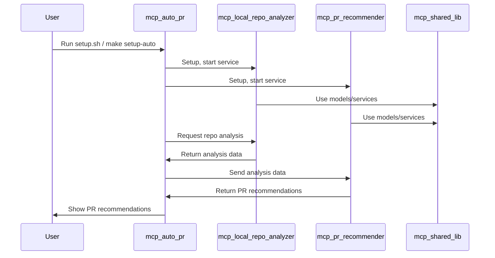
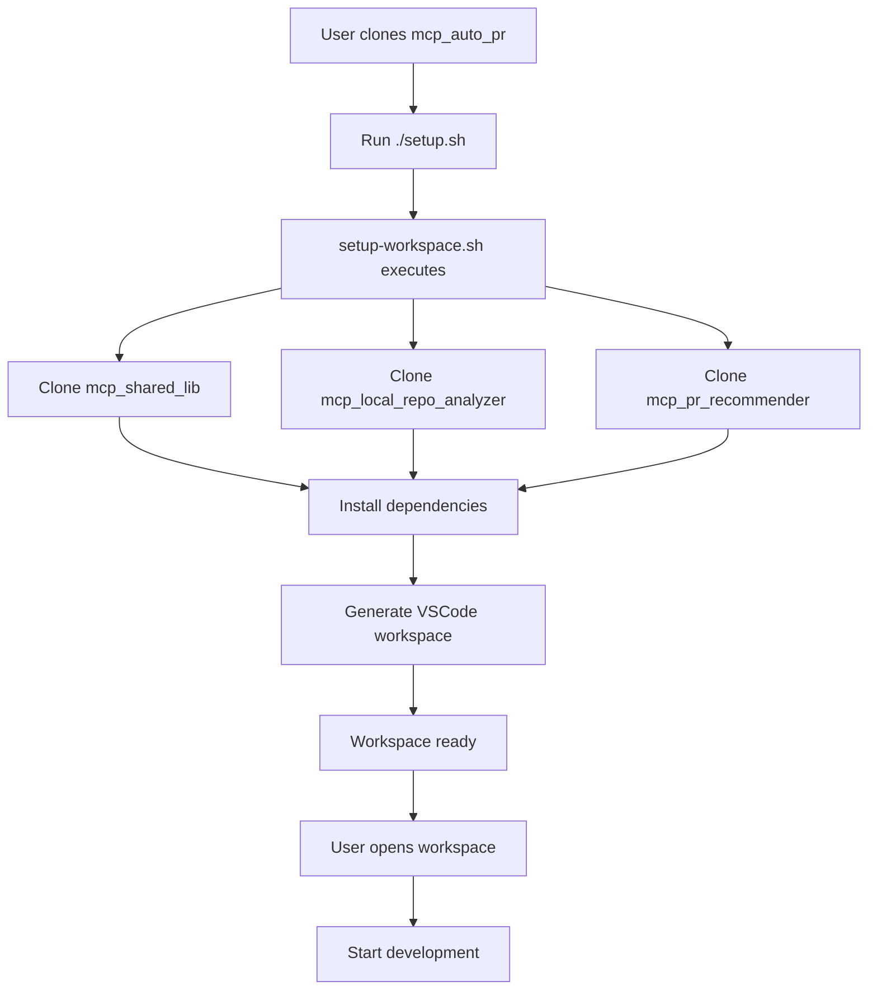

# MCP Auto PR System — Architecture Overview

The MCP Auto PR system is a modular, multi-repository platform for automating the analysis of local code changes and generating intelligent pull request (PR) recommendations across multiple repositories.

---

## High-Level Architecture

```mermaid
flowchart TD
    subgraph Workspace
        direction TB
        A[mcp_auto_pr<br/>(Orchestrator & Docs)]
        B[mcp_shared_lib<br/>(Shared Models & Services)]
        C[mcp_local_repo_analyzer<br/>(Local Git Analyzer)]
        D[mcp_pr_recommender<br/>(PR Recommender)]
    end

    A -- "Clones & orchestrates" --> B
    A -- "Clones & orchestrates" --> C
    A -- "Clones & orchestrates" --> D

    C -- "Uses" --> B
    D -- "Uses" --> B

    C -- "Analyzed repo changes" --> D
    D -- "PR recommendations" --> A
```

---

## Component Responsibilities

### 1. `mcp_auto_pr` (Orchestrator & Docs)
- **Role:** The main entry point and workspace orchestrator.
- **Responsibilities:**
  - Provides setup scripts to automatically clone and configure all other repositories.
  - Generates a unified VSCode multi-root workspace.
  - Offers Makefile targets for workspace management, testing, and service orchestration.
  - Hosts documentation and project planning resources.
- **Does not contain business logic** for analysis or PR recommendation.

**Key Files:**
```
mcp_auto_pr/
├── setup.sh                    # Top-level setup entry point
├── scripts/
│   ├── setup-workspace.sh      # Main workspace setup script
│   ├── config.sh               # Repository configuration
│   ├── test-setup.sh           # Workspace health testing
│   └── post-clone.sh           # Alternative setup script
├── Makefile                    # Workspace management commands
├── workspace/                  # VSCode workspace templates
└── docs/                       # Documentation
```

---

### 2. `mcp_shared_lib` (Shared Models & Services)
- **Role:** The foundation library for all MCP components.
- **Responsibilities:**
  - Houses common data models (e.g., file status, repo state, PR models).
  - Provides reusable services (e.g., Git client, change detector).
  - Contains configuration management and utility functions.
- **Used by:** Both the analyzer and recommender services.

**Directory Structure:**
```
mcp_shared_lib/
├── models/          # Data models (git, analysis, PR, base)
├── services/        # Business logic (git, PR)
├── tools/           # Tool base classes
├── utils/           # Utility functions
└── config/          # Configuration management
```

**Migration Status:**
- ✅ Phase 1: Foundation setup (models from mcp_local_repo_analyzer)
- ⏳ Phase 2: PR models migration (from mcp_pr_recommender)
- ⏳ Phase 3: Service migration
- ⏳ Phase 4: Repository updates
- ⏳ Phase 5: Testing & cleanup

---

### 3. `mcp_local_repo_analyzer` (Local Git Analyzer)
- **Role:** Analyzes outstanding local git changes in a repository.
- **Responsibilities:**
  - Detects uncommitted, staged, unpushed, and stashed changes.
  - Assesses risk and push readiness.
  - Provides a FastMCP server exposing analysis tools via API.
  - Uses models and services from `mcp_shared_lib`.
- **Outputs:** Structured analysis data for downstream consumption.

**Directory Structure:**
```
local_git_analyzer/
├── main.py        # FastMCP server entry point
├── config.py      # Configuration
├── models/        # Data models
├── services/      # Business logic
├── tools/         # FastMCP tools
└── tests/         # Tests
```

**Available Tools:**
- `analyze_working_directory` - Check uncommitted changes
- `analyze_staged_changes` - Check staged changes ready for commit
- `analyze_unpushed_commits` - Check commits not pushed to remote
- `analyze_stashed_changes` - Check stashed changes
- `get_outstanding_summary` - Get comprehensive summary of all changes
- `compare_with_remote` - Compare local branch with remote branch
- `get_repository_health` - Get overall repository health metrics

---

### 4. `mcp_pr_recommender` (PR Recommender)
- **Role:** Generates atomic, logically-grouped PR recommendations.
- **Responsibilities:**
  - Consumes git analysis data (from `mcp_local_repo_analyzer`).
  - Applies grouping strategies and risk analysis.
  - Exposes a FastMCP server with tools for PR generation, feasibility analysis, and validation.
  - Uses models and services from `mcp_shared_lib`.
- **Outputs:** Structured PR recommendations (titles, descriptions, rationale).

**Directory Structure:**
```
pr_recommender/
├── main.py        # FastMCP server entry point
├── config.py      # Configuration
├── models/        # Data models
├── services/      # Business logic
├── tools/         # FastMCP tools
└── tests/         # Tests
```

**Available Tools:**
- `generate_pr_recommendations` - Main tool to generate PR recommendations
- `analyze_pr_feasibility` - Analyze feasibility and risks of recommendations
- `get_strategy_options` - Get available grouping strategies and settings
- `validate_pr_recommendations` - Validate generated recommendations for quality

---

## Data & Control Flow



---

## Workspace Setup Flow



---

## Integration Points

### Setup & Orchestration
- **`mcp_auto_pr` scripts** automate cloning, environment setup, and workspace generation
- **Makefile targets** provide unified commands for workspace management
- **Configuration files** centralize repository URLs, branches, and settings

### Service Communication
- **FastMCP APIs** expose tools from analyzer and recommender services
- **Data exchange** between services uses structured models from `mcp_shared_lib`
- **Future enhancement:** Direct Python calls between services for better performance

### Shared Models
- **Type safety** ensured by using common models across all components
- **Consistency** maintained through centralized data definitions
- **Extensibility** supported by base classes and inheritance patterns

---

## Development Workflow


**Common Commands:**
```bash
# Setup
make setup-auto      # Auto-clone all repos and setup
make test-setup      # Test if workspace is properly setup

# Development
make install-all     # Install all dependencies
make test-all        # Run all tests
make format-all      # Format all code

# Services
make serve-analyzer  # Start analyzer service
make serve-recommender # Start recommender service
```

---

## Extensibility

### Adding New Analysis Capabilities
- **Extend analyzer tools** by adding new FastMCP tools in `mcp_local_repo_analyzer/tools/`
- **Add new models** to `mcp_shared_lib/models/` for shared data structures
- **Implement services** in `mcp_shared_lib/services/` for reusable business logic

### Adding New PR Strategies
- **Extend recommender tools** by adding new strategies in `mcp_pr_recommender/tools/`
- **Configure strategies** through the strategy manager tool
- **Validate strategies** using the validation tool

### Adding New Repositories
- **Update configuration** in `scripts/config.sh` with new repository details
- **Modify workspace generation** in `scripts/setup-workspace.sh` if needed
- **Test setup** using `make test-setup` to verify integration

### API Layer Flexibility
- **Swap FastMCP** for another API layer with minimal changes
- **Business logic** is modular and independent of transport layer
- **Service interfaces** are well-defined and can be adapted

---

## Future Enhancements

### Centralized API Gateway
- **Unified endpoint** for all services
- **Authentication and authorization** layer
- **Rate limiting and monitoring**

### UI Integration
- **Web dashboard** for visualizing recommendations
- **Repository health monitoring** interface
- **PR creation workflow** automation

### CI/CD Integration
- **Automated PR creation** based on recommendations
- **Review workflow** integration
- **Deployment pipeline** coordination

### Advanced Analytics
- **Change pattern analysis** across repositories
- **Risk prediction** models
- **Performance optimization** recommendations

---

## Summary

The MCP Auto PR system is a robust, extensible platform for automating code change analysis and PR generation. Built on a modular, multi-repo architecture with clear separation of concerns and strong code reuse via a shared library, it provides:

- **Automated workspace setup** with intelligent repository management
- **Comprehensive git analysis** with risk assessment and health monitoring
- **Intelligent PR recommendations** with multiple grouping strategies
- **Extensible architecture** supporting future enhancements and integrations
- **Developer-friendly workflow** with unified tooling and documentation

The system is designed to scale from single-repository analysis to multi-repo enterprise environments while maintaining simplicity and usability for individual developers.
