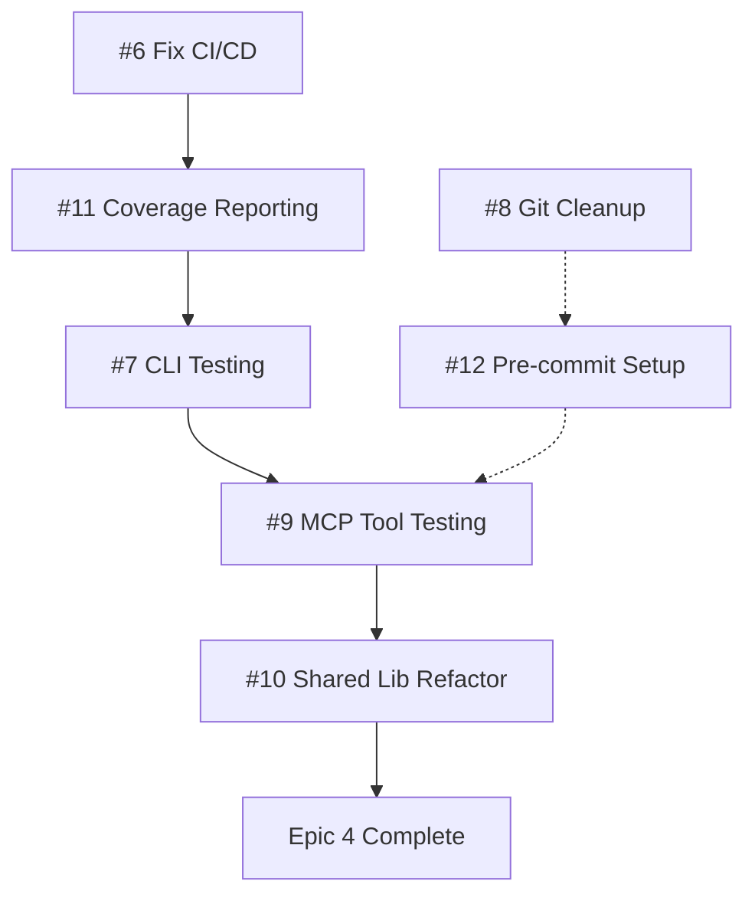

# GitHub Issues Summary - v0.2.0 Release

## 🎯 Overview
Created comprehensive GitHub issues for the MCP Auto PR v0.2.0 release focusing on stability, test coverage, and production-grade improvements.

## 📋 Created Issues

### 🏷️ Labels Created
- `epic` - Epic-level issues containing multiple user stories
- `priority/critical` - Critical priority - must be completed  
- `priority/high` - High priority - should be completed
- `sprint-1` - Sprint 1 (Week 1) - Critical fixes and stability
- `sprint-2` - Sprint 2 (Week 2) - Enhancements and polish
- `user-story` - User story within an epic

### 🎯 Milestone Created
- **v0.2.0** - Due: January 24, 2025
- **Description**: MCP Auto PR v0.2.0 Release - Stability and Improvements

## 📊 Epic Issues

### Epic 1: CI/CD Pipeline Stability
**Issue #2** | Priority: Critical | Sprint 1 | 3 days effort
- Fix GitHub Actions workflow failures
- Standardize test execution
- Set up code quality pipeline
- Implement test coverage reporting
- Add basic security scanning

### Epic 2: Test Coverage Implementation  
**Issue #3** | Priority: Critical | Sprint 1 | 5 days effort
- Target: 70%+ coverage on critical paths
- CLI module testing (80% target)
- MCP tool testing (85% target)
- Service layer testing (75% target)
- Integration testing setup

### Epic 3: Development Workflow Cleanup
**Issue #4** | Priority: High | Sprint 1 | 2 days effort  
- Clean repository state (git status clean)
- Standardize code quality tools
- Development environment setup
- Contribution guidelines
- Development scripts and automation

### Epic 4: Shared Library Improvements
**Issue #5** | Priority: High | Sprint 2 | 3 days effort
- Rename mcp_shared_lib → shared
- Reorganize code structure
- Remove dead code (BaseMCPTool, etc.)
- Consolidate models
- Move package-specific code

## 📋 User Story Issues

### Sprint 1 - Critical Path

#### CI/CD & Testing (Epic 1 & 2)
- **Issue #6**: Fix GitHub Actions workflow failures
  - Priority: Critical | 1 day
  - Fix exit code 127 errors, permissions, missing dependencies

- **Issue #7**: Implement CLI module testing for both packages  
  - Priority: Critical | 1 day
  - Target 80% coverage on CLI modules

- **Issue #9**: Test MCP tool implementations with realistic scenarios
  - Priority: Critical | 2 days
  - Target 85% coverage on all tools

- **Issue #11**: Set up test coverage reporting and enforcement
  - Priority: Critical | 0.5 days
  - Codecov integration, badges, thresholds

#### Development Workflow (Epic 3)
- **Issue #8**: Clean up uncommitted changes across all repositories
  - Priority: High | 0.5 days
  - Review and commit/discard all pending changes

- **Issue #12**: Standardize pre-commit configuration across all repositories
  - Priority: High | 0.5 days
  - Single config template for all repos

### Sprint 2 - Improvements

#### Shared Library (Epic 4)
- **Issue #10**: Rename mcp_shared_lib to 'shared' and reorganize structure
  - Priority: High | 1 day
  - Production-grade naming and organization

## 📈 Sprint Planning

### Sprint 1 (Days 1-7) - Critical Path
**Goal**: Achieve stable, tested, documented codebase

#### Week 1 Breakdown:
- **Day 1**: Fix CI/CD pipeline (#6) + Start coverage reporting (#11)
- **Day 2**: CLI testing (#7) + Git cleanup (#8)  
- **Day 3**: MCP tools testing part 1 (#9)
- **Day 4**: MCP tools testing part 2 (#9)
- **Day 5**: Pre-commit standardization (#12) + Service layer testing
- **Day 6**: Integration testing + Coverage goals
- **Day 7**: Sprint 1 wrap-up, Sprint 2 prep

### Sprint 2 (Days 8-14) - Polish & Enhancement
**Goal**: Production-ready shared library and documentation

#### Week 2 Focus:
- Shared library improvements (#10, #5)
- Documentation updates
- Security enhancements
- Docker improvements
- Final release preparation

## 🔗 Issue Dependencies

**Critical Path**: #6 → #11 → #7 → #9 → #10
**Parallel Work**: #8, #12 can run alongside main critical path

## 🎯 Success Metrics

### Sprint 1 Targets
- **CI Success Rate**: >95%
- **Test Coverage**: 70%+ overall, 80%+ critical paths
- **Build Time**: <10 minutes
- **Clean Repos**: All git status clean

### Sprint 2 Targets  
- **Code Organization**: Production-grade structure
- **Documentation**: Complete and accurate
- **Release Readiness**: All P0/P1 issues complete

## 🔧 Next Steps

### Immediate Actions
1. **Start with Issue #6** - Fix CI/CD pipeline (blocks everything else)
2. **Parallel: Issue #8** - Clean git repos (quick win)
3. **Then: Issue #11** - Coverage reporting (enables testing work)
4. **Follow critical path** through testing issues

### Team Coordination
- Issues are properly labeled for filtering
- Milestone tracks overall progress
- Dependencies clearly documented
- Time estimates provided for planning

## 📝 Links
- **Milestone**: https://github.com/manavgup/mcp_auto_pr/milestone/1
- **All Issues**: https://github.com/manavgup/mcp_auto_pr/issues
- **Epic Issues**: Filter by `label:epic`
- **Sprint 1**: Filter by `label:sprint-1`
- **Critical**: Filter by `label:priority/critical`

## 📚 Documentation References
- [v0.2.0 Overview](./overview.md)
- [Epic 1: CI/CD Stability](./epic-1-cicd-stability.md)
- [Epic 2: Test Coverage](./epic-2-test-coverage.md)
- [Epic 3: Development Workflow](./epic-3-dev-workflow.md)
- [Epic 4: Shared Library Improvements](./epic-4-shared-library.md)